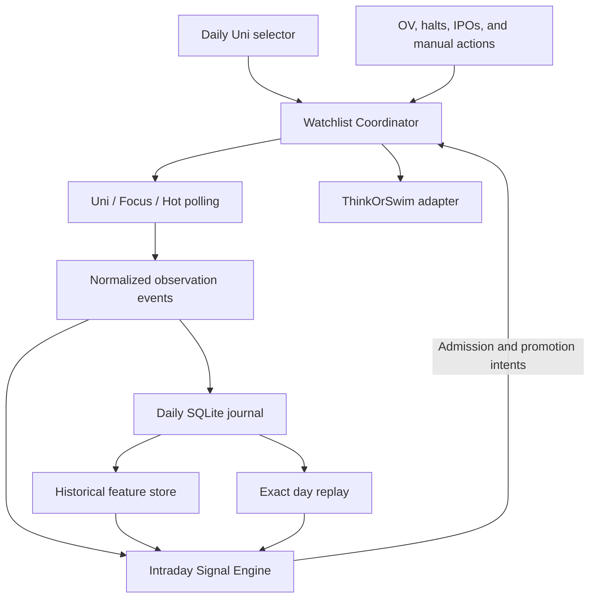

# mb_market_data

Reusable market-data acquisition and normalization for the MasterBot project.

> **Development status:** Active proof of concept.
>
> Implemented functionality currently includes:
>
> * Nasdaq Trade Halt acquisition and filtering;
> * stateful Nasdaq LUDP/M monitoring;
> * Schwab quote acquisition;
> * Schwab price-history probes;
> * ThinkOrSwim Watchlist parsing;
> * live decision-snapshot assembly combining ToS `OV_DECISION` data with Schwab quotes.
>
> The full historical Overnight Volume database and MasterBot-computed OV analytics are **not yet implemented**.

## Purpose

`mb_market_data` provides reusable market-data acquisition and normalization for higher-level MasterBot applications.

The package is intentionally separate from Watchlist policy and ThinkOrSwim GUI automation.

Its job is to answer questions such as:

* what does the Nasdaq halt feed currently contain?
* which symbols have new volatility halts?
* what are the current Schwab quote fields for a symbol set?
* what historical price bars are available from Schwab?
* what did ThinkOrSwim report for `OV_DECISION`?
* how can ToS-derived fields and Schwab market data be combined into one normalized decision snapshot?

Higher-level repositories decide what to do with that data.

Current consumers include:

```text
schwab_watchlists
mb_watchlist_coordinator
```

---

# Architecture

The intended layering is:

```text
external market-data sources
        |
        +--> Nasdaq Trade Halt feed
        |
        +--> Schwab API
        |
        +--> ThinkOrSwim CSV exports
        |
        v
mb_market_data
        |
        v
normalized acquisition objects
        |
        +--> halt events
        +--> quote batches
        +--> price-history data
        +--> decision snapshots
        |
        v
higher-level producer logic
```

For example:

```text
ThinkOrSwim OV_DECISION
        +
live Schwab quotes
        |
        v
DecisionSnapshotBatch
        |
        v
schwab_watchlists OV producer
        |
        v
ProducerIntent(BASE_SET)
```

And:

```text
Nasdaq Trade Halt feed
        |
        v
NasdaqHaltMonitor
        |
        v
new LUDP/M symbols
        |
        v
schwab_watchlists LUDP producer
        |
        v
ProducerIntent(ENSURE_PRESENT)
```

`mb_market_data` itself does not own Watchlist policy.

---

# Time convention

Market-session logic uses Eastern Time:

```text
America/New_York
```

This is the canonical timezone for:

* trading-session dates;
* overnight windows;
* premarket windows;
* halt-session interpretation;
* output filenames associated with market events.

UTC may still be used internally for timestamp storage or explicit provenance fields where appropriate.

---

# Nasdaq Trade Halt acquisition

Core module:

```text
src/mb_market_data/nasdaq_halts.py
```

The current acquisition path retrieves the Nasdaq Trader Trade Halt feed and parses halt records into structured objects.

Implemented capabilities include:

* current-feed retrieval;
* historical-date retrieval where supported by the source;
* filtering by ET trading date;
* filtering by halt reason code;
* detection of volatility halts;
* unique halt-event extraction;
* unique-symbol extraction;
* market/listing metadata preservation.

Current volatility reason codes:

```text
LUDP
M
```

These correspond to volatility-pause use cases for the current MasterBot POC.

The halt feed may include securities listed on exchanges other than Nasdaq.

Do not assume that all records returned by the feed are Nasdaq-listed securities.

---

# Nasdaq halt monitor

Core module:

```text
src/mb_market_data/nasdaq_halt_monitor.py
```

`NasdaqHaltMonitor` provides stateful new-event detection.

The monitor distinguishes:

```text
pending
```

from:

```text
seen / acknowledged
```

This distinction is important for downstream reliability.

A higher-level application can:

1. retrieve halt records;
2. ask which symbols are pending;
3. attempt downstream processing;
4. call `mark_seen()` only after that processing succeeds.

Conceptually:

```text
Nasdaq feed
    |
    v
pending_symbols()
    |
    v
downstream processing
    |
    +--> success --> mark_seen()
    |
    +--> failure --> remain pending
```

This behavior is used by the Watchlist coordinator POC so that a halt is not acknowledged merely because it appeared in the feed.

---

# Nasdaq probes

Development probes include:

```text
probes/probe_nasdaq_trade_halts.py
probes/monitor_nasdaq_trade_halts.py
```

Typical current-feed probe:

```cmd
python probes\probe_nasdaq_trade_halts.py
```

Historical-date probe:

```cmd
python probes\probe_nasdaq_trade_halts.py --date 2026-08-13
```

The probes are intended for acquisition validation and development diagnostics.

They are not the final production application layer.

---

# Schwab quote acquisition

Schwab quote acquisition provides reusable batched quote retrieval.

Current goals include:

* retrieving current quote data for a symbol set;
* preserving per-symbol success/failure information;
* avoiding silent loss of symbols;
* supporting higher-level decision-snapshot construction.

The Watchlist POC uses live Schwab quotes as a companion source to ToS `OV_DECISION`.

Conceptually:

```text
symbols
   |
   v
batched Schwab quote requests
   |
   v
QuoteBatch
   |
   v
DecisionSnapshotBatch
```

The acquisition layer should preserve enough information to distinguish:

```text
quote succeeded
quote unavailable
quote request failed
```

rather than simply dropping unusable symbols.

---

# Schwab price history

The repository includes Schwab price-history probes for exploring:

* supported historical ranges;
* bar aggregation;
* time-window behavior;
* returned OHLCV fields;
* session interpretation.

These probes are groundwork for future MasterBot-computed Overnight Volume.

They are not yet a complete historical-data service or database layer.

---

# ThinkOrSwim Watchlist parsing

Core parsing logic reads ThinkOrSwim Watchlist CSV exports.

ThinkOrSwim files may contain preamble lines before the actual CSV header.

For example:

```text
Watchlist 'default'

default
Symbol,OV_DECISION,Open,High,Low,Last,Day Close
...
```

The parser locates the actual `Symbol,...` header rather than assuming the first line is the header.

Current parsing recognizes `OV_DECISION` values such as:

```text
numeric
0.0
loading
NaN
blank
subscription-limit / unavailable states
```

This allows higher layers to distinguish usable from unavailable decision inputs.

---

# OV_DECISION

For the current proof of concept, `OV_DECISION` is calculated inside ThinkOrSwim as a custom Watchlist expression.

`mb_market_data` currently treats that value as externally supplied evidence.

The current live path is:

```text
ThinkOrSwim
    |
    v
OV_DECISION
    |
    v
Watchlist CSV
    |
    v
mb_market_data parser
```

MasterBot does **not yet** independently calculate the full Overnight Volume model.

That work is planned for later.

---

# Decision snapshots

The current decision-snapshot layer combines:

```text
same-day ToS Watchlist data
        +
live Schwab quote data
```

into normalized per-symbol decision records.

Core concepts include:

```text
DecisionSnapshot
DecisionSnapshotBatch
```

A snapshot can expose information such as:

* symbol;
* ToS `OV_DECISION`;
* whether the OV value is usable;
* whether a Schwab quote is available;
* quote fields needed by higher-level selection logic;
* source/provenance timestamps.

The batch builder is intentionally not a ranking engine.

Its job is to assemble normalized evidence.

Higher-level strategy belongs elsewhere.

---

# Live decision-snapshot acquisition

The live acquisition sequence is:

```text
read same-day ToS Watchlist
        |
        v
record ToS observation time
        |
        v
extract symbols
        |
        v
fetch live Schwab quotes
        |
        v
build DecisionSnapshotBatch
```

This path has been used successfully by the current Overnight Volume POC.

A development probe exists for validating the sequence.

The current POC application layer in `schwab_watchlists` reuses the same acquisition model.

---

# Current Overnight Volume POC role

The current MasterBot POC uses `mb_market_data` like this:

```text
large ToS candidate Watchlist
        |
        v
current OV_DECISION
        |
        +------------------+
        |                  |
        v                  v
ToS parser          Schwab quote fetch
        |                  |
        +--------+---------+
                 |
                 v
      DecisionSnapshotBatch
                 |
                 v
       schwab_watchlists
                 |
                 v
rank by OV_DECISION
                 |
                 v
ProducerIntent(BASE_SET)
```

The current ranking is intentionally simple.

The purpose is to validate the producer/coordinator/adapter architecture before investing heavily in the final historical OV model.

---

# Planned historical Overnight Volume architecture

The long-term goal is for MasterBot to compute Overnight Volume independently from stored market data.

Conceptually:

```text
historical intraday bars
        |
        v
overnight-window aggregation
        |
        v
historical OV store
        |
        +--> 3-day statistics
        +--> 5-day statistics
        +--> 10-day statistics
        +--> 30-day statistics
        |
        v
derived OV metrics
        |
        v
ranking / selection
```

This is future work.

---

# Overnight-window definitions

Current design uses Eastern Time.

## Current-day Overnight

Approximate decision window:

```text
00:00 ET
to
08:25 ET
```

A small buffer before 08:30 is used so that the decision can be completed before the market-open workflow.

## Historical comparison window

Historical overnight comparison:

```text
00:00 ET
to
08:30 ET
```

## Near-open / premarket metric

A separately defined near-open metric has been discussed as:

```text
SCHWAB_PREMARKET_V1
```

covering approximately:

```text
08:25 ET
to
09:30 ET
```

These definitions may evolve as the historical implementation is validated.

---

# Planned OV statistics

Desired future statistics include:

```text
3-day median
5-day median
10-day median
30-day median

3-day maximum
5-day maximum
10-day maximum
30-day maximum
```

Additional candidate metrics include:

* current OV relative to recent median;
* unusual-volume ratio;
* percentile/rank measures;
* persistence of elevated overnight activity;
* near-open volume;
* previous-close comparison;
* opening-price behavior;
* shares outstanding;
* market-cap proxy;
* price filters;
* liquidity filters.

These are strategy features and are intentionally not yet part of the acquisition layer.

---

# Storage and replay layers

Market-data persistence is divided into distinct layers so that live polling,
exact day replay, and long-horizon research do not force one database to serve
incompatible workloads.

## Daily observation journal

Each trading session has a separate SQLite journal. It records:

* polling-run software and configuration provenance;
* immutable membership revisions for named sampling channels;
* scheduled, dispatched, and completed acquisition times;
* one explicit status row for every requested symbol;
* normalized quote, volume, trade-time, and reference values.

The active journal belongs on MasterBot's local filesystem. SQLite WAL files
must not be placed on a Windows network share. After polling processes close
and the WAL is checkpointed, the completed daily journal may be archived or
transported as an ordinary file.

Sampling channels are named data, not fixed table structures. A symbol may be
observed through `uni`, `focus`, `hot`, or future channels, and may belong to
more than one channel at the same time. Promotion or an IPO admission creates
a new immutable channel revision; it never rewrites earlier observations.

The daily journal is the authoritative high-resolution input for replaying
what the system could have known, and in what order. Full Schwab response
payloads remain in the separate raw-evidence stream rather than being copied
into hundreds of thousands of database rows each day.

The universe quote-watch probe can opt into this journal while retaining its
existing JSONL and CSV evidence. Give both exact-slot processes the same
`--journal-root`; each derives the same session-dated database path:

```cmd
python probes\probe_universe_quote_watch.py --watchlist-kind uni --watchlist-revision 0 --journal-root output\quote_observation_journal
```

```cmd
python probes\probe_universe_quote_watch.py --watchlist-kind focus --watchlist-revision 0 --symbols SPY QQQ AAPL NVDA --journal-root output\quote_observation_journal
```

For example, both processes use
`output\quote_observation_journal\2026-09-10.sqlite3` on that session date.
SQLite WAL mode coordinates their independent writes. Journal recording is
disabled when `--journal-root` is omitted, preserving the original probe
behavior. If a completed acquisition cannot be written to the journal, its
raw JSONL evidence is flushed first, the error is recorded, and that polling
process stops with a nonzero exit status rather than continuing silently.

Each probe sample now reports three separate durations:

* `sample_elapsed_seconds`: Schwab acquisition time only;
* `journal_write_seconds`: the atomic SQLite journal transaction;
* `sample_end_to_end_seconds`: acquisition plus durable raw JSONL, journal,
  and per-symbol CSV output (the summary row used to record this measurement
  is excluded from its own timing).

The run manifest summarizes each duration with its count, median, p95, p99,
and maximum. This lets a full-session test show whether storage work is
starting to threaten the next polling slot rather than hiding it inside API
latency.

Audit a journal during the session or after the close with:

```cmd
python probes\audit_quote_observation_journal.py output\quote_observation_journal\2026-09-10.sqlite3
```

The audit is read-only. It checks SQLite integrity and foreign keys, schema
identity, channel revision/member counts, one observation per requested
symbol, result-status totals, run provenance, configured polling slots, and
SQLite/evidence sizes. While the market is open, it expects only slots due by
the audit time. After the configured polling window closes, a missing slot
causes the audit to fail and return exit status 1.

## Exact-day replay

The replay reader emits two immutable event types through one chronological
stream:

* a sampling-channel revision, including its complete membership;
* a completed quote acquisition, including one normalized outcome for every
  requested symbol.

Events are ordered by when the live system could have known them. A channel
revision becomes available at its effective time. An acquisition becomes
available at its completion time, not its scheduled time. Therefore, if one
request finishes out of order, replay preserves that fact. A revision wins a
same-timestamp tie so consumers always receive applicable membership before
quote observations.

Replay a completed journal as quickly as the computer can read it:

```cmd
python probes\replay_quote_observation_journal.py output\quote_observation_journal\2026-09-11.sqlite3
```

Other pacing modes use the same event sequence:

```cmd
rem One historical minute becomes one wall-clock second
python probes\replay_quote_observation_journal.py output\quote_observation_journal\2026-09-11.sqlite3 --speed 60

rem Preserve the original timing
python probes\replay_quote_observation_journal.py output\quote_observation_journal\2026-09-11.sqlite3 --real-time

rem Inspect events one at a time
python probes\replay_quote_observation_journal.py output\quote_observation_journal\2026-09-11.sqlite3 --step --limit 10
```

Scaled replay uses absolute deadlines, so processing time does not accumulate
as timing drift. At completion the command reports event, acquisition,
observation, channel, and status counts plus a SHA-256 digest of the exact
event-ID sequence. Replaying the same unchanged journal produces the same
counts and sequence digest.

Every emitted event also passes through `QuoteEventStateProjector`, the first
consumer of the common live/replay event boundary. Its final report shows each
channel's active revision, ordered member count, number of members with a
latest observation, latest outcome statuses, unique member count, and overlap
between channels. The projector retains observations separately by
`(channel, symbol)`, so a symbol may simultaneously have independent Uni,
Focus, and future Hot observations.

Membership changes do not destroy history. Removing a symbol makes it absent
from current channel rows while retaining its last observation for forensic
queries. Likewise, an in-flight acquisition captured under an older revision
may finish after a new revision becomes effective: its observations remain
valid under the captured revision without rolling current membership backward.
Projector snapshots are immutable and isolated from later events, providing a
safe input for dashboard rendering.

## Local market-state dashboard

The initial dashboard is a local Plotly Dash application backed by the same
framework-neutral projector used during replay. Dash owns presentation only;
it does not own membership, signals, polling, or persistence.

Install the project and its Dash dependencies into the active environment:

```cmd
python -m pip install -e .
```

Load a completed journal and start the local dashboard:

```cmd
python probes\dashboard_quote_observation_journal.py output\quote_observation_journal\2026-09-11.sqlite3
```

After projection finishes, open the displayed local address, normally:

```text
http://127.0.0.1:8050
```

By default, the dashboard opens at final replay state so it remains useful as
an end-of-day browser. Click **Restart** to return to the first event, choose a
speed, and then click **Play**. To open already positioned at the beginning:

```cmd
python probes\dashboard_quote_observation_journal.py output\quote_observation_journal\2026-09-11.sqlite3 --start-at-beginning
```

The controls provide play, pause, restart, single-event step, 1x/10x/60x/390x
speed selection, a historical clock, and event progress. At 60x, one historical
minute takes one second and a regular session takes roughly 6.5 minutes. At
390x, the regular session takes roughly one minute. A step is one complete
event: either a channel revision or an acquisition containing every requested
symbol outcome.

The operational display defaults to dark mode. The **Light mode** button in the
header switches the display palette and the browser remembers that preference.
Printing is independent of the display preference: print preview and printed
documentation always use a light, ink-efficient layout and omit the interactive
replay controls.

The dashboard shows session/replay time, event and observation totals, channel
revisions and coverage, and one sortable/filterable Dash AG Grid row per unique
current symbol. Each row shows channel membership, per-channel revision, latest
acquisition channel and status, quote prices, volume, observation time,
exchange, and description. Press `Ctrl+C` in the command window to stop the
server.

Replay streams acquisition observations from SQLite only when their event is
due; it does not retain the day's complete observation history in memory. Dash
receives immutable projector snapshots and never queries the journal directly.
One planned enhancement is a seek control accepting a specified historical ET
time, likely supplemented by a session-time slider. Seeking must reconstruct
state causally through the target time (or from a verified checkpoint) rather
than merely changing the displayed clock. Until that is implemented, restart
always reconstructs state from the beginning.

Another planned convenience is an exact symbol-list filter that accepts
symbols separated by spaces or commas, such as `NVDA AAPL MASK`, and displays
the union of those symbols. The current floating Symbol field remains a normal
single-value text filter.

The reader does not invent future state that version 1 journals do not contain.
For example, the 2026-09-11 journal can exactly reproduce its recorded static
`uni` and `focus` memberships and observations, but not hypothetical `hot`,
blocked, IPO, or halted-today changes. Those will become replayable after their
authoritative event records are added to a future journal schema.

## Intended polling and signal flow

Intraday signal calculation is a separate responsibility from Watchlist
membership policy. Live observations should be fanned out to both durable
storage and the signal engine; the signal engine should not query SQLite on
the live polling path.



During replay, journal observations are emitted through the same normalized
event boundary and signal logic, using only historical features that would
have been available at that point in time. The Coordinator remains the owner
of membership revisions; the signal engine emits evidence-backed intents but
does not mutate a Watchlist directly.

## Historical feature store

A separate long-term store will be built from completed daily journals and
other authoritative session inputs. It is expected to contain compact records
such as one normalized row per symbol/session/window and support:

* efficient retrieval of recent N-day history;
* 3/5/10/30-session medians and maxima;
* symbol churn and missing-session handling;
* reproducible Overnight Volume and other derived statistics;
* long-horizon back-testing and optimization;
* ET session-date semantics and source provenance.

The historical store is a derived product. Its contents can be regenerated
from retained daily journals when feature definitions change. Exact intraday
day replay continues to use the daily journal rather than the distilled store.

Daily retention and archive compression will be chosen after measuring real
session sizes. A synthetic normalized-row test suggests that a full session
will be hundreds of MiB rather than a small configuration database, reinforcing
the need for a separate compact historical feature store.

---

# Symbol-universe considerations

The Overnight Volume universe may contain several hundred securities.

ThinkOrSwim custom-expression subscription behavior has been observed to depend on the number of custom columns.

A large Watchlist of roughly 759 symbols was successfully exported when using a single custom `OV_DECISION` expression.

Using multiple custom expressions caused subscription-limit errors for a substantial portion of the same universe.

For the current POC:

```text
one OV_DECISION custom column
```

is preferred.

Long term, moving OV analytics to MasterBot should reduce dependence on ThinkOrSwim custom-expression limits.

---

# Current live POC result

A recent live POC successfully used:

```text
~760 current ToS candidates
```

with:

```text
751 usable OV_DECISION values
```

and live Schwab quotes.

The resulting higher-level application selected a top-N Watchlist and produced:

```text
ProducerIntent(BASE_SET)
```

for the MasterBot coordinator.

This demonstrates that the current acquisition/normalization layer is sufficient for the proof of concept.

---

# Repository layout

Important current areas include:

```text
mb_market_data/
├── src/
│   └── mb_market_data/
│       ├── nasdaq_halts.py
│       ├── nasdaq_halt_monitor.py
│       ├── tos_watchlist.py
│       ├── decision_snapshot.py
│       ├── decision_batch.py
│       └── Schwab acquisition modules
├── probes/
│   ├── probe_nasdaq_trade_halts.py
│   ├── monitor_nasdaq_trade_halts.py
│   ├── price-history probes
│   ├── quote probes
│   └── decision-snapshot probes
├── tests/
├── output/
├── README.md
└── pyproject.toml
```

Exact probe filenames may continue to evolve.

---

# Installation

Typical development installation:

```cmd
python -m pip install -e .
```

The live Schwab acquisition path requires the Schwab API dependency used by the broader MasterBot environment.

Associated projects include:

```text
mb_tools
mb_watchlist_coordinator
schwab_watchlists
ToS_scanner
```

---

# Tests

Run:

```cmd
pytest -q
```

or:

```cmd
python -m pytest -q
```

Tests should keep acquisition, parsing, filtering, and stateful-monitor behavior independently testable without requiring live ThinkOrSwim GUI automation.

---

# Security

Never commit:

* Schwab API secrets;
* passwords;
* decrypted credentials;
* token databases;
* `.ecfg` files;
* personal brokerage/account information.

Authentication support belongs in the shared secure configuration/tooling layer rather than in raw market-data modules.

---

# Design principles

## Acquisition is separate from strategy

`mb_market_data` acquires and normalizes evidence.

It should not decide which symbols belong in the MasterBot Watchlist.

## Preserve provenance

Decision inputs should retain enough source and timestamp information to explain where they came from.

## Preserve failures explicitly

A missing quote or unavailable custom expression should not silently disappear.

## Use ET for market-session semantics

Trading dates and market windows should be interpreted in `America/New_York`.

## Keep the POC simple

The current ToS `OV_DECISION` bridge is intentionally temporary.

Do not block architecture validation on the final historical analytics engine.

## Make future source replacement possible

The package should make it possible to replace or supplement:

```text
Schwab
```

with other providers later without rewriting Watchlist policy.

Potential future sources may include platforms such as Massive/Polygon.

---

# Current limitations

The following are not yet complete:

* historical OV database;
* production intraday-bar collection;
* MasterBot-computed Overnight Volume;
* historical 3/5/10/30-day statistics;
* final ranking/scoring model;
* persistent market-data service;
* production retention/archival;
* provider abstraction across multiple market-data APIs.

These are post-POC development areas.

---

# Relationship to downstream adapters

`mb_market_data` is a source/acquisition package.

It should remain independent of downstream materialization.

Future architecture may look like:

```text
market-data producers
        |
        v
WatchlistCoordinator
        |
        +--> ToS adapter
        |
        +--> Schwab adapter
        |
        +--> future adapter
```

A future direct Schwab downstream adapter would belong above or beside this acquisition layer, not inside the raw market-data package.

---

# Disclaimer

This is an independent personal software project.

It is not affiliated with, endorsed by, or supported by Charles Schwab, Nasdaq, ThinkOrSwim, Massive, Polygon, or any other provider.

The software is intended for development and experimentation.

It does not provide financial advice and does not place trades.
